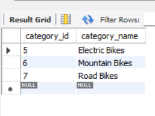
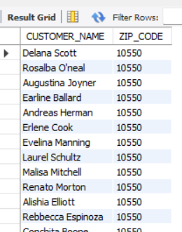
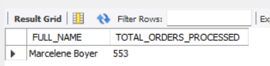

# Bicycle Sales Analysis
Data analysis of Bicycles sales and Orders

## Project Overview
The Bicycle Sales Analysis project aims to provide insightful data analysis for a bicycle retail business. Using SQL queries, this project explores various aspects of the business, including customer demographics, product performance, store operations, and sales trends. By leveraging a well-structured relational database, the project delivers actionable insights to optimize business strategies and improve decision-making.

# Tools & Library Used
 &nbsp;

# Project Result

[Click here to get full code](https://github.com/DikshantKhobragade/Bicycle-Sales-Analysis/blob/main/BIKE_SALES%20Analysis.sql)

# Query Task
1.	List all bike brands available in the database.

   
[]&nbsp;

2. Retrieve all customers who live in a specific state (e.g., "NY").

[]&nbsp;

3. Find all categories of bicycles where the category name contains "Bikes".

[]&nbsp;

4. Show the top 5 customers based on their zip code.

[]&nbsp;

5. List all customers who have purchased a specific brand of bicycle (e.g., "HELLER").

[]&nbsp;

6. Retrieve all bike categories associated with a specific brand (e.g., "Electra").

[]&nbsp;

7. Show the customer names along with the names of the bike categories they have purchased.

[]&nbsp;

8. Identify bike categories that have most bike sales.

[]&nbsp;

9. List all brands along with the total number of customers who purchased bikes from those brands, ranked by popularity.

[]&nbsp;

10. Find customers who share the same zip code as the most frequently occurring zip code.

[]&nbsp;

11. List all customers who have purchased bikes from more than 3 different brands.

[]&nbsp;

12. Top 5 products that generate the highest revenue.

[]&nbsp;

13. Identify which store generates the maximum revenue.

[]&nbsp;

14. List all customers who have placed orders, showing their full names, order dates, and the stores where the orders were placed.

[]&nbsp;

15. Find the total quantity sold for each product, showing the product name, total quantity, and revenue generated.

[]&nbsp;

16. Find all products that are in stock but have not been sold in any order.

[]&nbsp;

17. List all customers who have purchased products from multiple stores.

[]&nbsp;

18. Retrieve all orders where the shipped date is after the required date.

[]&nbsp;

19. Identify the staff member who has processed the highest number of orders.

[]&nbsp;

20. Retrieve the current stock of all products in each store, showing the product name, store name, and stock quantity.

[]&nbsp;

21. List the top 5 best-selling products across all stores.

[]&nbsp;

22. Find all orders that include products from a specific category (e.g., "Road Bikes").

[]&nbsp;

23. Identify products that have less than 10 units in stock across all stores.

[]&nbsp;

24. List brands whose products have collectively generated less than $60,000 in sales.

[]&nbsp;

25. Retrieve all orders that have not been shipped.

[]&nbsp;
